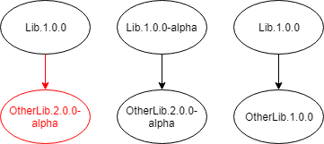

# NuGet and open-source libraries

NuGet is a package manager for the .NET eco-system and is the primary way developers discover and acquire .NET open-source projects. NuGet.org, a free service provided by Microsoft for hosting NuGet packages, is the primary host for public NuGet packages but you can publish to custom NuGet services like MyGet and Azure DevOps.


## Create a NuGet package

A NuGet package (`*.nupkg`) is a zip file containing .NET assemblies and associated metadata.

There are two main ways to create a NuGet package. The newer and recommended way is to create a package from a SDK-style project (project file the content starts with `<Project Sdk="Microsoft.NET.Sdk">`). Assemblies and targets are automatically added to the package and remaining metadata is added to the MSBuild file, like package name and version number. Compiling with the [`dotnet pack`](../../core/tools/dotnet-pack.md) command outputs a `*.nupkg` file instead of assemblies.

```xml
<Project Sdk="Microsoft.NET.Sdk">
  <PropertyGroup>
    <TargetFramework>netstandard2.0</TargetFramework>
    <AssemblyName>Contoso.Api</AssemblyName>
    <PackageVersion>1.1.0</PackageVersion>
    <Authors>John Doe</Authors>
  </PropertyGroup>
</Project>
```

The older way of creating a NuGet package is with a `*.nuspec` file and the `nuget.exe` command-line tool. A nuspec file gives you great control but you must carefully specify what assemblies and targets to include in the final NuGet package. It's easy to make a mistake or for someone to forget to update the nuspec when making changes. The advantage of a nuspec is you can use it create NuGet packages for frameworks that don't yet support an SDK-style project file.

**✔️ CONSIDER** using a SDK-style project file to create the NuGet package.

**✔️ CONSIDER** setting up SourceLink to add source control metadata to your assemblies and NuGet package.

**More information**

* [Creating NuGet packages](https://docs.microsoft.com/en-us/nuget/create-packages/creating-a-package)
* [Migrate from packages.config to PackageReference](https://docs.microsoft.com/en-us/nuget/reference/migrate-packages-config-to-package-reference)

## Package dependences

NuGet package dependencies are covered in detail [here](./dependencies.md).

## Important NuGet package metadata

A NuGet package supports many metadata properties. The following table contains the core metadata that every open-source project should provide:

| MSBuild Property name              | Nuspec name              | Description  |
| ---------------------------------- | ------------------------ | ------------ |
| `PackageId`                        | `id`                       | The package identifier. A prefix from the identifier can be reserved if it meets the [criteria](https://docs.microsoft.com/en-us/nuget/reference/id-prefix-reservation). |
| `PackageVersion`                   | `version`                  | NuGet package version. Read more about it [here](./versioning.md#nuget-package-version).             |
| `Title`                            | `title`                    | A human-friendly title of the package. It defaults to the `PackageId`.             |
| `Description`                      | `description`              | A long description of the package displayed in UI.             |
| `Authors`                          | `authors`                  | A comma-separated list of package authors, matching the profile names on nuget.org.             |
| `PackageTags`                      | `tags`                     | A space-delimited list of tags and keywords that describe the package. Tags are used when searching for packages.             |
| `PackageIconUrl`                   | `iconUrl`                  | A URL for an image to use as the icon for the package. URL should be HTTPS and the image should be 64x64 and have a transparent background.             |
| `PackageProjectUrl`                | `projectUrl`               | A URL for the project homepage or source repository.             |
| `PackageLicenseUrl`                | `licenseUrl`               | A URL to the project license. Can be the URL to the `LICENSE` file in source control.             |

**✔️ CONSIDER** choosing a NuGet package name with a prefix that meets NuGet's prefix reservation [criteria](https://docs.microsoft.com/en-us/nuget/reference/id-prefix-reservation).

**✔️ CONSIDER** using the `LICENSE` file in source control as the `LicenseUrl`. For example, https://github.com/JamesNK/Newtonsoft.Json/blob/master/LICENSE.md

> [!IMPORTANT]
> A project without a license defaults to [exclusive copyright](https://choosealicense.com/no-permission/), making it impossible for other people to use.

**✔️ DO** use an HTTPS href to your package icon.

> Sites like NuGet.org run with HTTPS enabled and displaying a non-HTTPS image will create a mixed content warning.

**✔️ DO** use a package icon image that is 64x64 and has a transparent background for best viewing results.

**More information**

* [.nuspec reference](https://docs.microsoft.com/en-us/nuget/reference/nuspec)

## Pre-release packages

NuGet packages with a version suffix are considered pre-release. By default the NuGet Package Manager UI shows stable releases unless a user opts-in to pre-release packages, making pre-release packages ideal for limited user testing.

```xml
<PackageVersion>1.0.1-beta1</PackageVersion>
```

> [!NOTE]
> A stable package cannot depend on a pre-release package. You must either make your own package pre-release, or depend on an older stable version.



**✔️ DO** publish a pre-release package when testing, previewing, or experimenting.

**✔️ DO** publish a stable package when its ready so other stable packages can reference it.

**More information**

* [Building pre-release packages](https://docs.microsoft.com/en-us/nuget/create-packages/prerelease-packages)

## Symbol packages

NuGet supports generating a separate symbol package containing debug PDB files alongside the main package containing .NET assemblies. The idea of symbol packages is they're hosted on a symbol server and are only downloaded by a tool like Visual Studio on demand.

Currently the main public host for symbols - [SymbolSource](http://www.symbolsource.org/) - doesn't support the portable PDBs created by SDK-style projects and symbol packages aren't useful.

**✔️ CONSIDER** embedding PDBs in the main NuGet package.

**❌ AVOID** creating a symbols package containing PDBs.

**More information**

* [Creating symbol packages](https://docs.microsoft.com/en-us/nuget/create-packages/symbol-packages)